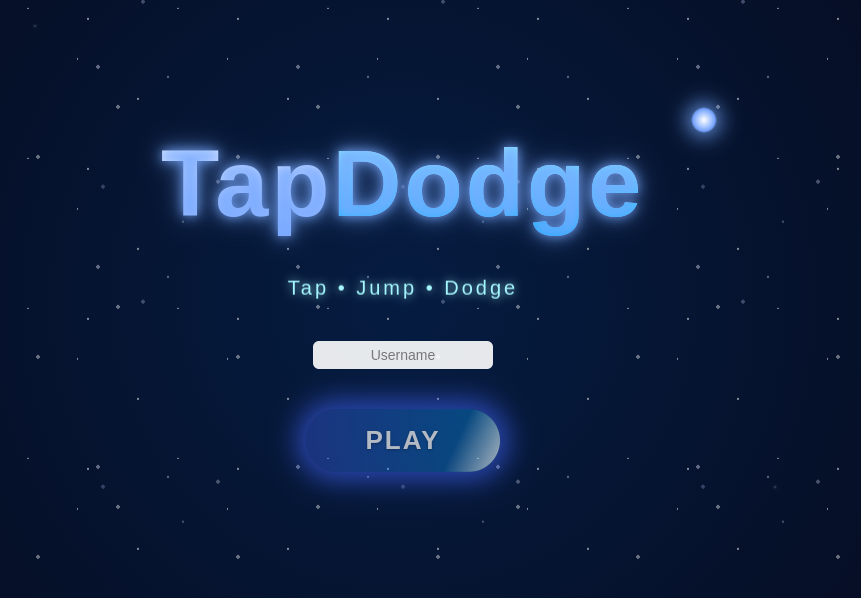
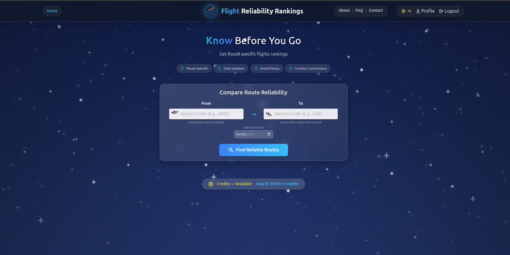
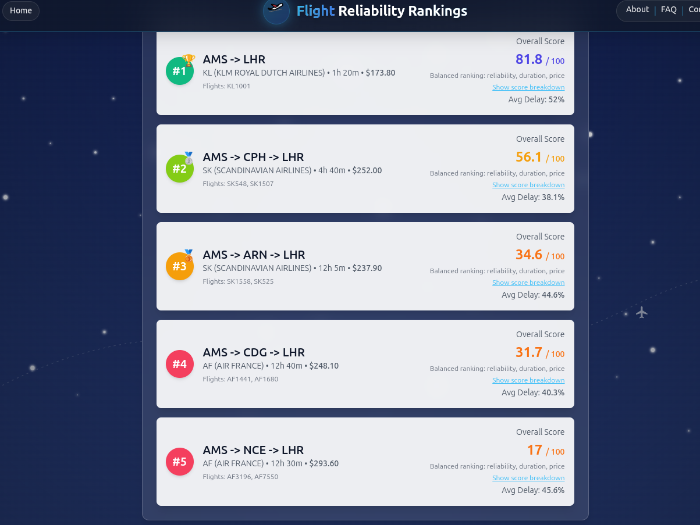

# LLM-Coding-Projects

We will use LLM to code and build projects.

 ## 1. Tap Dash

Tap Dash is a one-tap runner game where you control a character that automatically moves forward. Tap anywhere on screen to jump over obstacles and collect glowing orbs. The unique twist: It is multiplayer game and you can see other players in real-time!

### Game Preview

  <a href="tap-dash-server/videos/tap-dash-single-player.mp4" target="_blank">Click to watch gameplay video</a>

You can play the game [here](https://llms-first-projects.onrender.com/). Please note that the server may take a few minutes to start up on first access, as it automatically shuts down after 15 minutes of inactivity to conserve resources. If you enjoy the game and would like to help keep the servers running continuously, please consider supporting this project!

### 2. Airline Route Ranker

An MVP of "Route Specific "flights route ranker using real airlines data [website](https://www.bestflighs.org/)

  

  

It is free so give it a try!