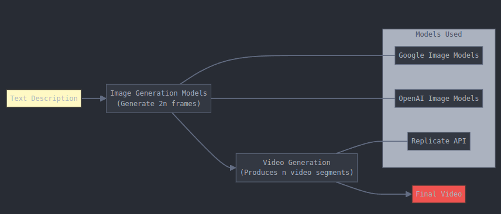

# LLM-Coding-Projects

We will use LLM to code and build projects.

 ## 1. Tap Dash

Tap Dash is a one-tap runner game where you control a character that automatically moves forward. Tap anywhere on screen to jump over obstacles and collect glowing orbs. The unique twist: It is multiplayer game and you can see other players in real-time!

### Game Preview

  <a href="tap-dash-server/videos/tap-dash-single-player.mp4" target="_blank">Click to watch gameplay video</a>

You can play the game [here](https://llms-first-projects.onrender.com/). Please note that the server may take a few minutes to start up on first access, as it automatically shuts down after 15 minutes of inactivity to conserve resources. If you enjoy the game and would like to help keep the servers running continuously, please consider supporting this project!

## 2. Text2Video

Text2Video is a project that explores using multimodal LLMs to generate videos from text descriptions.

The process works in three steps:

1. Key Frames Generation
   - Uses state-of-the-art image generation models from Google and OpenAI
   - Generates high-quality key frames based on the text description

2. Video Generation
   - Takes the generated key frames as input
   - Uses modern video generation models via Replicate's API
   - Produces smooth video transitions between frames

3. Video Editing
   - Uses video editing models to join clips and add audio to the video
   - Produces a final video

Note: While we use Replicate for convenient API access to video generation models, this is a paid service. You can alternatively self-host these models or use other providers.

  

#### A short 5 sec example

<table align="center">
  <tr>
    <td></td>
    <td></td>
    <td>➡️</td>
    <td></td>
  </tr>
  <tr>
    <td align="center">Frame 1</td>
    <td align="center">Frame 2</td>
    <td></td>
    <td align="center"><a href="text2Videos/assets/dragon.mp4" target="_blank">Click to watch video</a></td>
  </tr>
</table>

3.